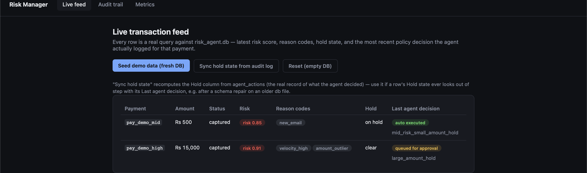
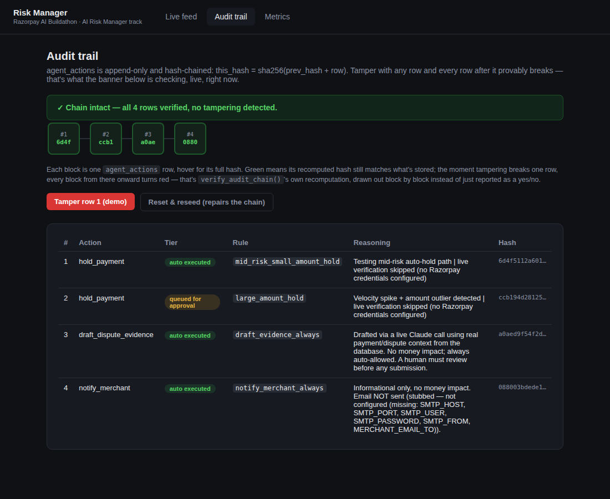
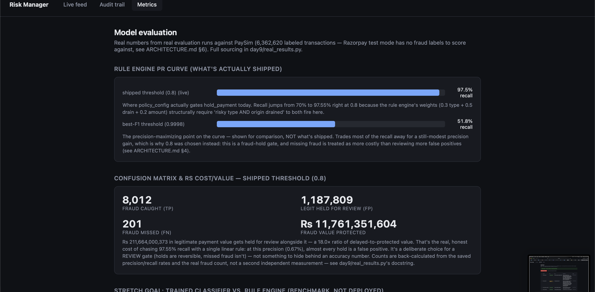
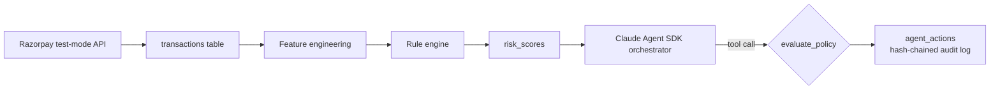

# Razorpay AI Risk Manager

An AI agent that detects payment fraud and disputes for Razorpay, with policy-gated autonomy tiers and a tamper-evident audit trail. Built solo for the [Razorpay AI Buildathon](https://razorpay.com/buildathon/) — AI Risk Manager track.

**One command to see it running:**

```bash
python3 day9/dashboard.py
# open http://127.0.0.1:5050, click "Seed demo data"
```

No API key needed for this path — it's the same policy engine, audit trail, and detector the rest of this README describes, just click-through instead of terminal output.

## What makes this different from "an LLM that scores fraud"

- **The agent's authority to touch money is defined in one auditable database table, not in prompt instructions.** [`policy_config`](sql/schema.sql) maps every action to `auto` / `approval_required` / `never_auto`, and [`evaluate_policy()`](agent/agent_tools.py) consults it on every single tool call — including from inside a live Claude Agent SDK loop, not just in isolated tests. See [`day6/run_scenario.py`](day6/run_scenario.py) for a real, verified run.
- **Every action is logged to a hash-chained, append-only audit log.** `this_hash = sha256(prev_hash + row)` — tamper with any row and every row after it provably breaks. Demoed live in `agent/agent_tools.py --demo`.
- **The detector is scored with real precision/recall, not a vibes-based accuracy number.** [`day5/evaluate.py`](day5/evaluate.py) ran the rule engine against 6.3M labeled transactions and produced an actual curve — the policy thresholds in `sql/schema.sql` come directly from that evaluation (see [`docs/ARCHITECTURE.md` §4](docs/ARCHITECTURE.md)), not from a guess.

## Quick start

```bash
# Easiest path — browser dashboard: live feed, audit trail with a live
# chain-verify banner, and a metrics page with real PR curve / confusion
# matrix / cost estimate. No API key, no other setup.
python3 day9/dashboard.py
# then open http://127.0.0.1:5050 and click "Seed demo data"
```

```bash
# Terminal demo — same policy gating + hash-chained audit trail, no API key needed
python3 agent/agent_tools.py --demo

# Full live agent loop — requires the Claude Code CLI installed & authenticated
# (npm install -g @anthropic-ai/claude-code, then `claude` to log in — draws
# from an existing Claude subscription, no extra API cost)
pip install claude-agent-sdk
python3 day6/run_scenario.py --live
```

The live run seeds two payments and one dispute, then hands control to a real Claude agent that has to decide what to do using only the gated tools — no scripted responses. It correctly auto-holds a small-amount payment, correctly queues a large-amount one for human approval, and drafts (but never submits) real dispute evidence via a live Claude call. As of Day 8 the honesty goes further than the agent's own reasoning: when `notify_merchant`'s real email channel isn't configured, the tool itself reports that plainly, and the orchestrating Claude reads that and tells the human, unprompted — *"the merchant may not have actually received the email... you should configure those environment variables."* Full trace in [`docs/BUILD_LOG.md`](docs/BUILD_LOG.md)'s Day 6 and Day 8 entries.

## Screenshots

Real screenshots of the dashboard above, running against real (seeded) data — nothing staged or mocked up for this README.

**Live feed** — policy-gated decisions as they happen: a small-amount payment auto-held, a large-amount one queued for human approval.



**Audit trail** — every action hash-chained, with a live tamper-check banner and the real reasoning text behind each decision.



**Metrics** — the PR curve and confusion matrix from `day5/evaluate.py`'s real evaluation, not a claimed number.



## Architecture

Full writeup, including the rationale behind every policy threshold, the hybrid rule-engine/ML scoping decision, and known limitations stated plainly: **[`docs/ARCHITECTURE.md`](docs/ARCHITECTURE.md)**.



## Real results, not claimed ones

Evaluated against PaySim (6,362,620 labeled transactions — Razorpay test mode has no real fraud labels to learn from, see `ARCHITECTURE.md` §6 for why):

| Threshold | Precision | Recall |
|---|---|---|
| 0.8 (risky type + balance drained) | 0.67% | **97.55%** |
| 0.9998 (best F1) | 1.58% | 51.80% |

0.13% of transactions are fraud, so 1.58% precision is a real ~12x lift over random — reported honestly rather than hidden behind an accuracy number, per the track's explicit ask. Full curve and methodology: [`day5/`](day5/), [`docs/ARCHITECTURE.md` §3a and §6](docs/ARCHITECTURE.md).

A trained classifier ([`day5/stretch_classifier.py`](day5/stretch_classifier.py)) beats the rule engine by a wide margin on the same held-out test set — 92.97% vs. 4.45% best-F1 precision — and that gain was checked, not just reported: an ablation ruled out PaySim's documented balance-column leakage as the cause (destination-balance features alone scored *worse* than the rule engine) before trusting the number. Full ablation and the honest catch — it can't be deployed to live Razorpay scoring without labeled Razorpay data — in [`docs/ARCHITECTURE.md` §3b](docs/ARCHITECTURE.md).

## Project structure

This is a real, incremental, dated build — the `dayN/` folders aren't a cosmetic choice, they mirror [`docs/BUILD_LOG.md`](docs/BUILD_LOG.md)'s day-by-day account of what was built, what broke, and how it got fixed.

| Path | What's in it |
|---|---|
| `sql/schema.sql` | The full data model — transactions, risk scores, the hash-chained audit log, disputes, and the policy table |
| `agent/agent_tools.py` | Policy engine, audit logging, all 7 gated tool functions, and the Agent SDK orchestrator |
| `agent/razorpay_client.py` | Live Razorpay payment-status verification (Day 7) |
| `agent/evidence_drafter.py` | Real Claude-drafted dispute evidence letters (Day 8) |
| `agent/notify_channel.py` | Real merchant email notifications (Day 8) |
| `day1/` | Agent SDK fundamentals — proving the tool-calling loop and permission-gate mechanism work |
| `day2/` | Live Razorpay test-mode integration — orders, payments, checkout, verified webhooks |
| `day3/` | Real dataset exploration (PaySim) and the fraud signals actually found in it |
| `day4/` | Feature engineering for live Razorpay data — including the honest gap analysis of which PaySim signals do and don't transfer |
| `day5/` | The rule engine, its real precision/recall evaluation, and the stretch-goal classifier with a leakage ablation check |
| `day6/` | The live Claude Agent SDK orchestrator, tools wired end to end |
| `day7/` | Live verification script for `hold_payment`/`release_payment` against a real completed checkout |
| `day9/` | The browser dashboard (`dashboard.py`) and its sourced metrics data (`real_results.py`) |
| `day10/edge_case_tests.py` | Real, re-runnable edge-case suite (23 cases) against the live policy engine, audit chain, and tool functions — `python3 day10/edge_case_tests.py` |
| `docs/` | Architecture rationale ([`ARCHITECTURE.md`](docs/ARCHITECTURE.md)), the full first-person build log ([`BUILD_LOG.md`](docs/BUILD_LOG.md)), the curated failure-modes writeup ([`FAILURE_MODES.md`](docs/FAILURE_MODES.md)), network troubleshooting notes, pre-submission checklist |

## Failure modes: what broke, what's still a known gap

The buildathon asks for real technical failures and how they were recovered from. **[`docs/FAILURE_MODES.md`](docs/FAILURE_MODES.md)** is the curated answer — real bugs found by actually running the code against real or realistic inputs (a malformed webhook body, a hallucinated-but-well-formed payment id, a stale pre-migration database, a two-click dashboard sequence that corrupts its own db file) and fixed, kept separate from limitations that are documented and deliberately left as-is because fixing them means building a feature this 10-day solo build never claimed to have. The full, unedited, first-person account of every one of these — as they happened, in order — is in [`docs/BUILD_LOG.md`](docs/BUILD_LOG.md). [`day10/edge_case_tests.py`](day10/edge_case_tests.py) is a real, re-runnable 23-case suite against the policy engine, audit chain, and tool functions — not just a claim, something you can run yourself.

## Known limitations

Stated explicitly rather than hidden — see [`docs/ARCHITECTURE.md` §10](docs/ARCHITECTURE.md) and [`docs/FAILURE_MODES.md`](docs/FAILURE_MODES.md) for the full reasoning behind each: `hold_payment` is internal state rather than a native Razorpay primitive (Razorpay has no "freeze this payment" endpoint), though it now reconciles against Razorpay's real live payment status before acting (Day 7); Razorpay's test mode has no way to simulate a dispute, so `submit_dispute_evidence`/`accept_dispute` are verified via a seeded-data live agent run rather than a real Razorpay dispute (`draft_dispute_evidence` itself is real and live — Day 8); there is no live webhook-to-database ingestion pipeline, so every transaction comes from a seed script, not a live Razorpay event; no external anchoring on the audit chain; single-agent architecture by deliberate scope, not oversight.
