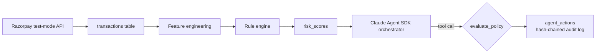

# Razorpay AI Risk Manager

An AI agent that detects payment fraud and disputes for Razorpay, with policy-gated autonomy tiers and a tamper-evident audit trail. Built solo for the [Razorpay AI Buildathon](https://razorpay.com/buildathon/) — AI Risk Manager track.

## What makes this different from "an LLM that scores fraud"

- **The agent's authority to touch money is defined in one auditable database table, not in prompt instructions.** [`policy_config`](sql/schema.sql) maps every action to `auto` / `approval_required` / `never_auto`, and [`evaluate_policy()`](agent/agent_tools.py) consults it on every single tool call — including from inside a live Claude Agent SDK loop, not just in isolated tests. See [`day6/run_scenario.py`](day6/run_scenario.py) for a real, verified run.
- **Every action is logged to a hash-chained, append-only audit log.** `this_hash = sha256(prev_hash + row)` — tamper with any row and every row after it provably breaks. Demoed live in `agent/agent_tools.py --demo`.
- **The detector is scored with real precision/recall, not a vibes-based accuracy number.** [`day5/evaluate.py`](day5/evaluate.py) ran the rule engine against 6.3M labeled transactions and produced an actual curve — the policy thresholds in `sql/schema.sql` come directly from that evaluation (see [`docs/ARCHITECTURE.md` §4](docs/ARCHITECTURE.md)), not from a guess.

## Quick start

```bash
# Zero-setup demo — policy gating + hash-chained audit trail, no API key needed
python3 agent/agent_tools.py --demo

# Full live agent loop — requires the Claude Code CLI installed & authenticated
# (npm install -g @anthropic-ai/claude-code, then `claude` to log in — draws
# from an existing Claude subscription, no extra API cost)
pip install claude-agent-sdk
python3 day6/run_scenario.py --live
```

The live run seeds two payments and one dispute, then hands control to a real Claude agent that has to decide what to do using only the gated tools — no scripted responses. It correctly auto-holds a small-amount payment, correctly queues a large-amount one for human approval, drafts (but never submits) dispute evidence, and sends one honest merchant notification that separates what actually executed from what's still pending — full trace in [`docs/BUILD_LOG.md`](docs/BUILD_LOG.md)'s Day 6 entry.

## Architecture

Full writeup, including the rationale behind every policy threshold, the hybrid rule-engine/ML scoping decision, and known limitations stated plainly: **[`docs/ARCHITECTURE.md`](docs/ARCHITECTURE.md)**.



## Real results, not claimed ones

Evaluated against PaySim (6,362,620 labeled transactions — Razorpay test mode has no real fraud labels to learn from, see `ARCHITECTURE.md` §6 for why):

| Threshold | Precision | Recall |
|---|---|---|
| 0.8 (risky type + balance drained) | 0.67% | **97.55%** |
| 0.9998 (best F1) | 1.58% | 51.80% |

0.13% of transactions are fraud, so 1.58% precision is a real ~12x lift over random — reported honestly rather than hidden behind an accuracy number, per the track's explicit ask. Full curve and methodology: [`day5/`](day5/), [`docs/ARCHITECTURE.md` §3a and §6](docs/ARCHITECTURE.md).

## Project structure

This is a real, incremental, dated build — the `dayN/` folders aren't a cosmetic choice, they mirror [`docs/BUILD_LOG.md`](docs/BUILD_LOG.md)'s day-by-day account of what was built, what broke, and how it got fixed.

| Path | What's in it |
|---|---|
| `sql/schema.sql` | The full data model — transactions, risk scores, the hash-chained audit log, disputes, and the policy table |
| `agent/agent_tools.py` | Policy engine, audit logging, all 7 gated tool functions, and the Agent SDK orchestrator |
| `day1/` | Agent SDK fundamentals — proving the tool-calling loop and permission-gate mechanism work |
| `day2/` | Live Razorpay test-mode integration — orders, payments, checkout, verified webhooks |
| `day3/` | Real dataset exploration (PaySim) and the fraud signals actually found in it |
| `day4/` | Feature engineering for live Razorpay data — including the honest gap analysis of which PaySim signals do and don't transfer |
| `day5/` | The rule engine and its real precision/recall evaluation |
| `day6/` | The live Claude Agent SDK orchestrator, tools wired end to end |
| `docs/` | Architecture rationale, the build log, network troubleshooting notes, pre-submission checklist |

## Known limitations

Stated explicitly rather than hidden — see [`docs/ARCHITECTURE.md` §10](docs/ARCHITECTURE.md): live Razorpay API calls inside the tool functions are still stubbed pending Day 7; `hold_payment` is internal state rather than a native Razorpay primitive (Razorpay has no "freeze this payment" endpoint); no external anchoring on the audit chain; single-agent architecture by deliberate scope, not oversight.
