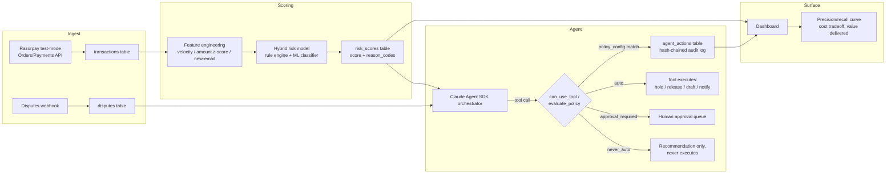

# Architecture — AI Risk Manager Agent (Razorpay AI Buildathon)

## 1. Problem framing

Razorpay's brief for this track: "Develop detectors for fraud, returns, and
chargebacks with precision/recall metrics." The buildathon's stated bar for
*any* money-touching submission is that actions must be **explainable,
bounded, and gated**, with **honest performance metrics** — not a system
that silently does the right thing 95% of the time and hides the other 5%.

This project is a risk-scoring pipeline plus a Claude Agent SDK agent that
sits on top of it. The model flags risk; the agent decides what to do about
it; but the agent's authority to actually touch money is deliberately small
and entirely defined in one auditable table (`policy_config`), not buried in
prompt instructions.

## 2. System diagram

Reference implementation of the DB layer: `sql/schema.sql`.
Reference implementation of the tool + policy layer: `agent/agent_tools.py`.
Tool contracts: `agent/tools_schema.json`.

## 3. Why a hybrid detector, not a pure LLM classifier

An LLM scoring "is this fraud, yes/no" from a text description of a
transaction is fast to build and looks impressive in a demo, but it produces
no calibrated probability, no reproducible feature basis, and no way to
compute a real precision/recall curve against a labeled dataset — which is
the literal deliverable this track asks for. So the detector is:

- **Rule engine** — deterministic checks (velocity: too many transactions
  from the same email/card in a window; amount anomalies vs. that method's
  recent distribution; new-email risk). Cheap, instantly explainable,
  catches the obvious cases.
- **ML classifier** (e.g. gradient-boosted trees on a public fraud dataset —
  see §6) — catches the subtler multivariate patterns rules miss.
- **Hybrid score** — the two are combined (e.g. `max()` or a weighted blend,
  tune during Days 2-3) into one `risk_scores.score`, but `reason_codes`
  preserves *which* signal fired, so the agent's downstream reasoning can
  cite a concrete cause ("held because: velocity_high, amount_outlier") —
  never "the model said so."

The LLM's job is downstream of scoring: deciding *what action* a given score
+ context warrants, and drafting human-readable artifacts (dispute evidence
letters, merchant notifications). That's a genuinely agentic task — the
model isn't well-suited to be the classifier, but it's well-suited to be the
policy-aware decision-maker and communicator sitting on top of one.

**Scoping note (added after Day 1):** the ML half of "hybrid" is treated as
an upgrade, not a dependency. The rule engine alone — deterministic checks,
scored against the labeled dataset with `sklearn.metrics.precision_recall_curve`
— is a complete P0 that satisfies the track's "precision/recall metrics" ask
on its own. A classifier (starting with plain logistic regression, not
gradient-boosted trees) is Day 5's stretch goal, attempted only after the
rule-engine baseline is shipped and evaluated. This ordering exists because
pandas/sklearn were new tools going into this build, not prior experience —
sequencing it this way means a skipped classifier costs nothing, where a
skipped rule engine would have cost the whole track.

## 3a. Feature engineering: what actually transfers from PaySim to Razorpay (Day 4)

Day 3's exploration of PaySim (see `day3/FINDINGS.md`) surfaced three
candidate fraud signals. Porting them onto real Razorpay data honestly,
rather than assuming they all carry over, mattered enough to document
explicitly:

- **Amount** transfers directly. Razorpay payments have a real `amount`
  field, so `amount_zscore_for_method` — how many standard deviations this
  payment's amount is from the recent mean for the *same payment method*
  (card vs. UPI vs. netbanking have very different normal ranges, so
  comparing across methods would just be noise) — is a legitimate, direct
  descendant of Day 3's amount-skew finding.
- **Transaction type** has only a loose analog. PaySim's fraud concentration
  in `TRANSFER`/`CASH_OUT` doesn't map cleanly onto Razorpay's `method`
  field (`card`/`upi`/`netbanking`/`wallet`/`emi`), and there's no labeled
  real-world data available to this project to calibrate per-method fraud
  rates against. Deliberately **not** hardcoded as a rule in Day 4 —
  revisit only if Day 5's evaluation shows a clear need, with real evidence,
  not a guess ported from a different domain.
- **Origin-balance-drained-to-zero — does not exist in this project's real
  data, at all.** PaySim's strongest signal needs before/after account
  balances. Razorpay is a payment gateway, not a bank ledger: the actual
  payment payload verified live in Day 2 (`fetch_payment.py`) has no
  balance fields on either side. This isn't a simplification — it's a
  signal that is structurally unavailable here, and pretending otherwise
  would be exactly the kind of hidden gap the "honest metrics" requirement
  in §6 exists to prevent.

**What replaces it:** velocity and identity checks —
`txns_last_1h_same_email`, `txns_last_24h_same_card`, `is_new_email` (all
three already reserved as columns in `sql/schema.sql`). These are the
standard substitute in real payment-gateway fraud detection when
account-balance data isn't available, and arguably fit this project's
actual threat model (card-testing sprees, stolen-card runs, one identity
attempting many payments fast) better than balance drainage would have
anyway, which is more of a bank-account/wallet-fraud concern than a
gateway-fraud one.

Implementation: `day4/feature_engineering.py` — pure, database-free
`compute_features()` for the core logic plus a thin `compute_features_from_db()`
I/O wrapper, same "testable core, thin wrapper" split as `webhook_verify.py`
and `agent_tools.py`'s `tool_*` functions. Verified by
`day4/test_feature_engineering.py` (13/13 checks passing), including a check
that runs the wrapper against the *actual* `sql/schema.sql` DDL loaded into
an in-memory SQLite database, not just a hand-rolled dict shape that could
silently drift from the real schema. Cold-start is handled explicitly too:
`amount_zscore_for_method` returns `NULL`/`None` rather than a fabricated
`0.0` when fewer than two same-method transactions exist yet to compare
against — a `0.0` would falsely claim "perfectly average," which the
function has no basis to assert with that little history.

## 4. The autonomy-tier policy (the "bounded and gated" story)

Every tool the agent can call is mapped, in `policy_config`, to one of three
tiers. This table — not a prompt instruction — is the source of truth, and
`can_use_tool` / `evaluate_policy()` consult it on every single tool call.

| Tier | Meaning | Example rule |
|---|---|---|
| `auto` | Executes immediately, logged as `auto_executed` | Mid-risk (0.4-0.75) hold on amounts ≤ ₹10,000 |
| `approval_required` | Agent's proposed action is logged as `queued_for_approval` and a human must execute it | High risk (≥0.75) holds; any amount > ₹10,000; submitting dispute evidence |
| `never_auto` | The tool function *cannot* execute the real effect no matter what — enforced in code, not just config | `accept_dispute` (conceding money) always returns `queued_for_approval`, by design, in `tool_accept_dispute()` |

Rationale for the specific numbers:

- **₹10,000 amount ceiling for auto-hold** — a hold is reversible (see §5),
  so it's the lowest-stakes action available; a threshold roughly at the
  median transaction size in most SMB merchant flows keeps the "auto" lane
  useful without ever putting a large sum on autopilot. Tune with real data
  on Day 4-5 once amount distributions are visible.
- **Any dispute submission requires a human** — this isn't a probability
  judgment, it's a category judgment: submitting evidence is irreversible
  and affects Razorpay's own relationship with the card network on the
  merchant's behalf, so no confidence score justifies full autonomy here.
  This mirrors why Razorpay's own Agent Studio "Dispute Responder" product
  frames itself as *drafting* optimized evidence, with the merchant still in
  the loop for submission.
- **Unknown action types fail safe, not open** — `evaluate_policy()`'s
  default return is `("approval_required", "default_fail_safe")`. A tool
  call for an action type with no matching policy row is *never* silently
  allowed. (This bit us in our own demo — see the bug note in
  `agent_tools.py`'s `run_demo()`: forcing a hold on a genuinely low-risk
  transaction correctly fell back to `approval_required` because no `auto`
  rule existed for that combination. We left the fail-safe as-is rather than
  patch the policy to make the demo "pass" — that's the honest-metrics ethos
  applied to our own code, not just the model.)

## 5. What "held" actually means (a scoping note for the panel)

Razorpay's API does not expose a native "freeze this payment" endpoint —
capture/refund are the real levers. For this build, `hold_payment` is
implemented as an internal state flag (`agent_actions` + a status field) that
gates a *later* capture/refund decision, not a live call that mutates
Razorpay's own ledger. This is intentionally documented rather than glossed
over: better to be precise about what's simulated internal state vs. a real
API mutation than to imply an integration depth that isn't there in 10 days.

## 6. Evaluation methodology (the "honest metrics" requirement)

- **Dataset**: a public, pre-labeled fraud dataset — PaySim (synthetic
  mobile-money transactions, popular for hackathons, has a `isFraud` label)
  or the IEEE-CIS Fraud Detection dataset (Kaggle) — used to train/evaluate
  the ML component, since Razorpay's test-mode API has no real fraud labels
  to learn from. This substitution is stated explicitly in the demo/pitch,
  not hidden: *"the detector is validated against a public labeled dataset;
  the Razorpay integration is validated against live test-mode API calls;
  these are two different, both-necessary kinds of correctness."*
- **Metrics reported**: full precision-recall curve (not a single accuracy
  number — accuracy is meaningless on an imbalanced fraud dataset), the
  operating point actually chosen for the demo policy thresholds, and a
  confusion matrix.
- **Cost framing**: alongside precision/recall, report an estimated ₹ cost
  of false positives (blocked legitimate customers) vs. ₹ value of true
  positives caught, using the dataset's amount field — this is the "measured
  value" Razorpay's judging language calls for, not just an ML leaderboard
  number.
- **What the model will NOT catch**: state this explicitly in the pitch —
  e.g. collusive/first-party fraud patterns not present in the training
  distribution, cold-start on genuinely new merchants with no transaction
  history. Naming the failure modes is part of "honest," not a weakness to
  hide.

## 7. Explainability approach

Three layers, cheapest-to-richest:

1. `risk_scores.reason_codes` — which rule(s)/feature(s) fired, always present.
2. `risk_scores.feature_snapshot` — the exact feature vector at scoring time,
   for reproducibility (you can re-run the model against this snapshot
   later and get the same score).
3. `agent_actions.agent_reasoning` — Claude's own natural-language
   justification for the action it took or proposed, logged verbatim.

SHAP-style per-feature attribution was considered and deliberately deferred
past the 10-day scope — reason_codes + feature_snapshot already answer "why"
concretely, and spending a build day on SHAP integration would trade a
polish item for a core-flow risk. Noted here as a Day 11+ roadmap item so
the panel sees it was a scoping decision, not an oversight.

## 8. Audit trail integrity

`agent_actions` is append-only and hash-chained: each row's `this_hash` =
`sha256(prev_hash + canonical_json(row))`. `verify_audit_chain()` walks the
table and recomputes every hash; a single edited field anywhere in the
table's history breaks the chain at that row and every row after it. This
is demoed live in `agent/agent_tools.py --demo` (tamper a row, re-verify,
watch it fail). It's not cryptographically tamper-*proof* (no external
anchoring — that's the honest caveat: an attacker with DB write access could
rewrite the whole chain from that point forward and it would look internally
consistent), but it detects incidental/accidental corruption and any
after-the-fact edit that doesn't also rewrite everything downstream, which is
the realistic threat model for a "did someone quietly edit the log" question.

## 9. Alignment with Razorpay's own Agent Studio

Razorpay has already shipped Agent Studio (built on the Claude Agent SDK),
with pre-built agents including Dispute Responder, Subscription Recovery,
RTO Shield, and Settlement Insights. This project isn't a clone of any one
of them, but it's built with the same shape: narrow, tool-using agents with
explicit autonomy boundaries around money-touching actions, not a general
chat agent with API access. That's a deliberate alignment choice, not a
coincidence — it's the shape of system Razorpay has publicly signaled it
wants built.

## 10. Known limitations / explicitly out of scope for the 10-day build

- Live Razorpay API calls are stubbed with `# TODO` markers in
  `agent_tools.py`, to be filled in Day 6 once test API keys are wired up.
- `hold_payment` is internal state, not a native Razorpay primitive (§5).
- No SHAP/per-feature attribution (§7) — reason codes + feature snapshot only.
- Audit chain has no external anchoring (§8).
- Single-agent architecture — no multi-agent handoff (deliberately scoped
  out for a solo 10-day build; see the buildathon strategy doc for why).

## 11. Roadmap if this became a real 6-12 month internship project

- Real precision-recall monitoring in production with drift detection.
- External anchoring for the audit chain (e.g. periodic hash publication).
- Multi-agent split: a dedicated Recovery agent and Finance agent consuming
  the same `risk_scores`/`agent_actions` tables, coordinated rather than
  merged into one orchestrator.
- SHAP-based per-transaction explanations for the merchant-facing dashboard.
