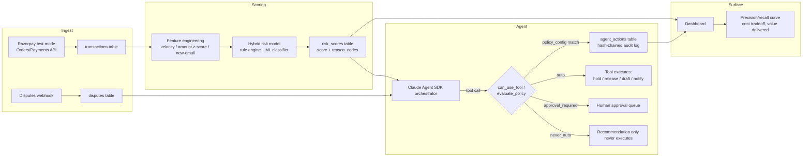

# Architecture — AI Risk Manager Agent (Razorpay AI Buildathon)

## 1. Problem framing

Razorpay's brief for this track: "Develop detectors for fraud, returns, and
chargebacks with precision/recall metrics." The buildathon's stated bar for
*any* money-touching submission is that actions must be **explainable,
bounded, and gated**, with **honest performance metrics** — not a system
that silently does the right thing 95% of the time and hides the other 5%.

This project is a risk-scoring pipeline plus a Claude Agent SDK agent that
sits on top of it. The model flags risk; the agent decides what to do about
it; but the agent's authority to actually touch money is deliberately small
and entirely defined in one auditable table (`policy_config`), not buried in
prompt instructions.

## 2. System diagram

Reference implementation of the DB layer: `sql/schema.sql`.
Reference implementation of the tool + policy layer: `agent/agent_tools.py`.
Tool contracts: `agent/tools_schema.json`.

## 3. Why a hybrid detector, not a pure LLM classifier

An LLM scoring "is this fraud, yes/no" from a text description of a
transaction is fast to build and looks impressive in a demo, but it produces
no calibrated probability, no reproducible feature basis, and no way to
compute a real precision/recall curve against a labeled dataset — which is
the literal deliverable this track asks for. So the detector is:

- **Rule engine** — deterministic checks (velocity: too many transactions
  from the same email/card in a window; amount anomalies vs. that method's
  recent distribution; new-email risk). Cheap, instantly explainable,
  catches the obvious cases.
- **ML classifier** (e.g. gradient-boosted trees on a public fraud dataset —
  see §6) — catches the subtler multivariate patterns rules miss.
- **Hybrid score** — the two are combined (e.g. `max()` or a weighted blend,
  tune during Days 2-3) into one `risk_scores.score`, but `reason_codes`
  preserves *which* signal fired, so the agent's downstream reasoning can
  cite a concrete cause ("held because: velocity_high, amount_outlier") —
  never "the model said so."

The LLM's job is downstream of scoring: deciding *what action* a given score
+ context warrants, and drafting human-readable artifacts (dispute evidence
letters, merchant notifications). That's a genuinely agentic task — the
model isn't well-suited to be the classifier, but it's well-suited to be the
policy-aware decision-maker and communicator sitting on top of one.

**Scoping note (added after Day 1):** the ML half of "hybrid" is treated as
an upgrade, not a dependency. The rule engine alone — deterministic checks,
scored against the labeled dataset with `sklearn.metrics.precision_recall_curve`
— is a complete P0 that satisfies the track's "precision/recall metrics" ask
on its own. A classifier (starting with plain logistic regression, not
gradient-boosted trees) is Day 5's stretch goal, attempted only after the
rule-engine baseline is shipped and evaluated. This ordering exists because
pandas/sklearn were new tools going into this build, not prior experience —
sequencing it this way means a skipped classifier costs nothing, where a
skipped rule engine would have cost the whole track.

## 3a. Feature engineering: what actually transfers from PaySim to Razorpay (Day 4)

Day 3's exploration of PaySim (see `day3/FINDINGS.md`) surfaced three
candidate fraud signals. Porting them onto real Razorpay data honestly,
rather than assuming they all carry over, mattered enough to document
explicitly:

- **Amount** transfers directly. Razorpay payments have a real `amount`
  field, so `amount_zscore_for_method` — how many standard deviations this
  payment's amount is from the recent mean for the *same payment method*
  (card vs. UPI vs. netbanking have very different normal ranges, so
  comparing across methods would just be noise) — is a legitimate, direct
  descendant of Day 3's amount-skew finding.
- **Transaction type** has only a loose analog. PaySim's fraud concentration
  in `TRANSFER`/`CASH_OUT` doesn't map cleanly onto Razorpay's `method`
  field (`card`/`upi`/`netbanking`/`wallet`/`emi`), and there's no labeled
  real-world data available to this project to calibrate per-method fraud
  rates against. Deliberately **not** hardcoded as a rule in Day 4 —
  revisit only if Day 5's evaluation shows a clear need, with real evidence,
  not a guess ported from a different domain.
- **Origin-balance-drained-to-zero — does not exist in this project's real
  data, at all.** PaySim's strongest signal needs before/after account
  balances. Razorpay is a payment gateway, not a bank ledger: the actual
  payment payload verified live in Day 2 (`fetch_payment.py`) has no
  balance fields on either side. This isn't a simplification — it's a
  signal that is structurally unavailable here, and pretending otherwise
  would be exactly the kind of hidden gap the "honest metrics" requirement
  in §6 exists to prevent.

**What replaces it:** velocity and identity checks —
`txns_last_1h_same_email`, `txns_last_24h_same_card`, `is_new_email` (all
three already reserved as columns in `sql/schema.sql`). These are the
standard substitute in real payment-gateway fraud detection when
account-balance data isn't available, and arguably fit this project's
actual threat model (card-testing sprees, stolen-card runs, one identity
attempting many payments fast) better than balance drainage would have
anyway, which is more of a bank-account/wallet-fraud concern than a
gateway-fraud one.

Implementation: `day4/feature_engineering.py` — pure, database-free
`compute_features()` for the core logic plus a thin `compute_features_from_db()`
I/O wrapper, same "testable core, thin wrapper" split as `webhook_verify.py`
and `agent_tools.py`'s `tool_*` functions. Verified by
`day4/test_feature_engineering.py` (13/13 checks passing), including a check
that runs the wrapper against the *actual* `sql/schema.sql` DDL loaded into
an in-memory SQLite database, not just a hand-rolled dict shape that could
silently drift from the real schema. Cold-start is handled explicitly too:
`amount_zscore_for_method` returns `NULL`/`None` rather than a fabricated
`0.0` when fewer than two same-method transactions exist yet to compare
against — a `0.0` would falsely claim "perfectly average," which the
function has no basis to assert with that little history.

## 3b. The Day 5 stretch goal: does a trained model actually beat the rule engine? (added 2026-08-26)

Real answer, evaluated properly: **yes, meaningfully, and it's been checked
for the failure mode that would make that claim untrustworthy.**

`day5/stretch_classifier.py` trains a `HistGradientBoostingClassifier` on
PaySim and compares it against the rule engine on an identical, temporally
held-out test set (train on earlier `step`s, test on later ones — see the
script's own docstring for why a random split would be too easy). Headline
result, both scorers on the same 1,248,736-row test set:

| Scorer | Best-F1 precision | Best-F1 recall | Precision @ recall≥0.90 |
|---|---|---|---|
| Rule engine | 4.45% | 52.68% | 1.75% |
| ML model (full features) | 92.97% | 85.25% | 84.93% |

A jump that large deserved suspicion before belief. The rule engine only
ever used origin-side balances (`oldbalanceOrg`/`newbalanceOrig`) plus type
and amount; the model additionally had `oldbalanceDest`/`newbalanceDest` —
and PaySim has a *documented* leakage issue in its balance columns (a
model that predicts fraud from `oldbalanceOrig == amount` gets suspiciously
high accuracy for reasons that are an artifact of how the simulator
generates data, not a real fraud pattern — see "Explainable Fraud Detection
with Deep Symbolic Classification," [arXiv:2312.00586](https://arxiv.org/html/2312.00586v1),
which flags the same risk around destination-balance imputation).

So before trusting the number, ran an ablation — the same model, trained on
three different feature subsets, same test set:

| Feature set | Best-F1 precision | Best-F1 recall | Precision @ recall≥0.90 |
|---|---|---|---|
| `origin_only` (same info as the rule engine) | 84.90% | 91.27% | 85.68% |
| `full` (adds dest balances) | 92.97% | 85.25% | 84.93% |
| `dest_only` (destination balances alone) | 12.87% | 7.93% | 0.50% |

This rules out the leakage hypothesis in its strong form: `dest_only` is
*worse* than the rule engine, not suspiciously good — destination balances
alone carry almost no signal on this dataset. And `origin_only` nearly
matches (arguably beats, on recall) the `full` model — so the huge gain
over the rule engine isn't coming from a leaky column at all. It's coming
from a gradient-boosted model finding sharper, nonlinear, interaction-aware
decision boundaries in the *exact same information* the rule engine has —
type, amount, and origin-balance-drain — instead of one fixed linear
weighted sum (`0.3·type + 0.5·drain + 0.2·amount`). That's a legitimate
result: a hand-authored rule engine was always going to leave real signal
on the table that a trained model, given the same inputs, could recover.

**Also tested and rejected:** the naive `hybrid_avg` (a plain average of
the model's probability and the rule engine's score) — it underperforms
the model alone on every metric in both ablations (e.g. `origin_only`
best-F1 f1=0.8797 for the model alone vs. 0.8389 for the average blend).
Averaging in a much weaker, noisier score just adds noise. If a hybrid ever
ships, it should combine the rule engine's `reason_codes` as human-readable
explanation alongside the model's score — not blend the two numbers
together.

**Decision, given the numbers:** if/when this model is used for anything
beyond a benchmark, it should train on `origin_only` features, not `full` —
performance is equivalent-to-better (higher recall, comparable precision)
and it removes the destination-balance question from the conversation
entirely rather than needing this ablation explained every time.

**The catch this doesn't get around:** exactly like the rule engine (§3a),
this model is trained and evaluated entirely on PaySim's own columns —
`oldbalanceOrg`/`newbalanceOrig` don't exist in live Razorpay data, for the
same structural reason documented in §3a (Razorpay is a payment gateway,
not a bank ledger). And unlike the rule engine, this model *can't* be
manually re-derived for Razorpay-native features the way the rule engine's
STRUCTURE was ported in Day 4 (velocity/identity checks standing in for
balance-drain) — a supervised model needs labeled data to train on, and
Razorpay's test mode has no fraud labels, which is the entire reason PaySim
was used here in the first place (§6). So this classifier is real, honestly
evaluated proof that the rules-to-ML upgrade path is worth pursuing and
quantifies by how much — not something wired into `agent_tools.py`'s live
scoring path today. `sql/schema.sql`'s `scoring_source` already has
`'ml_model'`/`'hybrid'` reserved in its CHECK constraint for exactly this,
whenever labeled Razorpay data exists to justify the training (see §11
Roadmap).

## 3c. Real dispute evidence drafting and merchant notification (Day 8)

`tool_draft_dispute_evidence` no longer returns a fixed template. It now
pulls the real payment row, dispute row, and latest risk score from the
database and passes them to a live `claude` CLI call
(`agent/evidence_drafter.py`), which drafts a summary + explanation letter
+ its own honest confidence score. The prompt explicitly instructs Claude
not to invent supporting facts (delivery confirmations, customer
communications, tracking numbers) that aren't in the real data — verified
directly: a test run against a payment with genuinely thin evidence
produced a letter that said so plainly and self-rated confidence at 0.10-
0.15, not an inflated number. A human still reviews every draft before
anything is ever submitted (`submit_dispute_evidence` stays
`approval_required` regardless of confidence, unchanged from Day 6).

Why the `claude` CLI in print mode rather than the `anthropic` SDK or
`claude_agent_sdk`'s `ClaudeSDKClient`: the raw API SDK needs a standalone
`ANTHROPIC_API_KEY` — separate billing from the Claude subscription this
whole project is built to use (see README's quick start); `ClaudeSDKClient`
is built for a multi-turn tool-calling loop, which drafting a letter isn't.
The CLI's print mode is a synchronous, subscription-authenticated,
single-turn call — the right weight for a text-generation sub-task, and it
keeps `tool_draft_dispute_evidence` a plain synchronous function like every
other tool, consistent with how Day 7's live Razorpay calls are also
synchronous I/O inside the same tool functions.

Soft-optional like every other real integration in this project: if the
`claude` CLI isn't on PATH, times out, or returns something that doesn't
parse as the expected JSON shape, `tool_draft_dispute_evidence` falls back
to an OBVIOUSLY generic placeholder (`confidence: 0.0`, a literal
`[TODO fill]`) rather than something that could be mistaken for a real
draft — verified once in practice: the very first live-agent run hit this
exact fallback path (a transient CLI hiccup, not a bug), then succeeded
cleanly on retry. Both outcomes are correct behavior, not a failure.

`tool_notify_merchant` sends a real email via `agent/notify_channel.py`
(stdlib `smtplib`, zero new dependencies) when `SMTP_HOST` /`SMTP_PORT`/
`SMTP_USER`/`SMTP_PASSWORD`/`SMTP_FROM`/`MERCHANT_EMAIL_TO` are all set,
and otherwise reports itself as honestly `stubbed` — verified live end to
end via `day6/run_scenario.py --live`: with no SMTP configured, the
orchestrating Claude itself read the tool's own honest `sent: False`
result and told the human directly, unprompted, "the merchant may not have
actually received the email" — the soft-fail-and-report design working
correctly all the way up through the agent's own natural-language summary,
not just at the tool-return level.

## 3d. The dashboard (Day 9)

`day9/dashboard.py` is a single-file Flask app — Flask because it's
already a proven dependency (Day 2's `webhook_listener.py`), not a new
one, matching the tracker's explicit "keep the framework choice boring."
One file on purpose: a judge should be able to read every route, query,
and template in one place rather than hunt across a `templates/` folder.

Three routes, one per judge-facing question this project exists to
answer:

- `/` (live feed) answers "what is the agent looking at right now?" —
  real `transactions` rows joined against each payment's latest
  `risk_scores` row and most recent `hold_payment`/`release_payment`
  entry in `agent_actions`. Risk chips and reason codes render straight
  from stored data, not a recomputed or summarized version of it.
- `/audit` answers "can I trust the log?" — calls `verify_audit_chain()`
  live on every page load and shows its real result in a banner. A
  "Tamper row 1" button performs an actual `UPDATE` against
  `agent_actions` and redirects back, so the chain-intact banner visibly
  flips to chain-broken on the next load — the same proof `--demo` already
  does at the CLI, now click-through for the pitch video.
- `/metrics` answers "is the detector actually good, and what does that
  cost?" — the rule engine's real PR curve, a back-calculated confusion
  matrix and ₹ cost/value estimate at the shipped 0.8 threshold, and the
  Day 5-stretch ablation table, all sourced in `day9/real_results.py`.

Two honesty constraints carried over from the rest of the project:

1. **No dashboard-only logic.** The "seed demo data" and reset buttons
   call the exact same `seed_demo_scenario()` / `init_db()` /
   `verify_audit_chain()` functions the CLI (`--demo`) and
   `day6/run_scenario.py` already use — extracted from `run_demo()`
   specifically so the dashboard couldn't end up with a second,
   independently-drifting copy of "what the demo scenario is."
2. **The metrics page is not a live re-scoring.** `day9/real_results.py`
   holds baked-in numbers from real evaluation runs already documented in
   §3a/§3b, with every number's source cited in the module's comments —
   re-running `day5/evaluate.py` and `day5/stretch_classifier.py` against
   the full 6.3M-row PaySim dataset per page load would take minutes, and
   the dataset isn't shipped with the repo in the first place. The
   confusion matrix shown is explicitly labeled as *back-calculated* from
   the saved precision/recall rates and the real fraud count — the
   original evaluation runs saved rates, not raw TP/FP/FN/TN counts — not
   a second independent measurement.

## 4. The autonomy-tier policy (the "bounded and gated" story)

Every tool the agent can call is mapped, in `policy_config`, to one of three
tiers. This table — not a prompt instruction — is the source of truth, and
`can_use_tool` / `evaluate_policy()` consult it on every single tool call.

| Tier | Meaning | Example rule |
|---|---|---|
| `auto` | Executes immediately, logged as `auto_executed` | Risk score ≥ 0.8 hold on amounts ≤ ₹10,000 |
| `approval_required` | Agent's proposed action is logged as `queued_for_approval` and a human must execute it | Any amount > ₹10,000 (regardless of score); submitting dispute evidence |
| `never_auto` | The tool function *cannot* execute the real effect no matter what — enforced in code, not just config | `accept_dispute` (conceding money) always returns `queued_for_approval`, by design, in `tool_accept_dispute()` |

Rationale for the specific numbers:

- **`risk_score >= 0.8` for a hold, evidence-based from Day 5** —
  `day5/evaluate.py` ran the actual rule engine (`day5/rule_engine.py`)
  against PaySim and produced a real precision/recall curve
  (`day5/pr_curve_results.csv`). `0.8` isn't a guess: it's exactly where
  the rule engine's weights (`WEIGHT_TYPE` 0.3 + `WEIGHT_DRAIN` 0.5 = 0.8)
  require both "risky transaction type" and "origin balance drained to
  zero" to fire together — and recall jumps from 70% to 97.55% right at
  that point, while precision barely moves either side of it. Above 0.8,
  chasing a stricter score-only tier costs real recall for almost no
  precision gain (see `day5/pick_thresholds.py`'s output), so there's
  deliberately no separate, higher-score `approval_required` tier — see
  below for why amount does that job instead.
- **₹10,000 amount ceiling separates `auto` from `approval_required`, not
  a second risk-score threshold** — a hold is reversible (see §5), so it's
  the lowest-stakes action available. Since Day 5's evaluation showed the
  rule engine's precision plateaus quickly above 0.8 (topping out around
  1.6%), a second, stricter score cutoff wouldn't reliably distinguish
  "very confident" from "somewhat confident" — the signal just isn't that
  granular. Amount is the more honest lever: `mid_risk_small_amount_hold`
  (score ≥ 0.8, amount ≤ ₹10,000) auto-holds; `large_amount_hold` (any
  amount > ₹10,000) requires a human *regardless of score* — intentionally
  conservative, since a large transaction deserves a look even at a lower
  confidence flag.
- **Any dispute submission requires a human** — this isn't a probability
  judgment, it's a category judgment: submitting evidence is irreversible
  and affects Razorpay's own relationship with the card network on the
  merchant's behalf, so no confidence score justifies full autonomy here.
  This mirrors why Razorpay's own Agent Studio "Dispute Responder" product
  frames itself as *drafting* optimized evidence, with the merchant still in
  the loop for submission.
- **Unknown action types fail safe, not open** — `evaluate_policy()`'s
  default return is `("approval_required", "default_fail_safe")`. A tool
  call for an action type with no matching policy row is *never* silently
  allowed. (This bit us in our own demo — see the bug note in
  `agent_tools.py`'s `run_demo()`: forcing a hold on a genuinely low-risk
  transaction correctly fell back to `approval_required` because no `auto`
  rule existed for that combination. We left the fail-safe as-is rather than
  patch the policy to make the demo "pass" — that's the honest-metrics ethos
  applied to our own code, not just the model.)

## 5. What "held" actually means (a scoping note for the panel)

Razorpay's API does not expose a native "freeze this payment" endpoint —
capture/refund are the real levers. For this build, `hold_payment` is
implemented as an internal state flag (`transactions.on_hold` / `held_at`,
added Day 7 — kept as its own columns rather than folded into `status`, so
Razorpay's own payment states and our review gate can never silently
contradict each other) that gates a *later* capture/refund decision, not a
live call that mutates Razorpay's own ledger. This is intentionally
documented rather than glossed over: better to be precise about what's
simulated internal state vs. a real API mutation than to imply an
integration depth that isn't there in 10 days.

**Day 7 update — the flag is now set from a live source, not blind trust in
local state.** Before `tool_hold_payment` / `tool_release_payment` act, they
call `agent/razorpay_client.py` to fetch the payment's real, current status
from Razorpay's Payments API and reconcile it into `transactions.status` if
it's changed since we last saw it. If the live status comes back
`refunded` or `failed`, the tool short-circuits to `denied` with
`policy_rule_applied = "live_status_check"` before `evaluate_policy()` is
even consulted — there's nothing meaningful to hold on a payment that's
already dead on Razorpay's side, and that's a factual check, not a policy
judgment call, so it's deliberately not modeled as a policy rule. Without
API credentials configured (`RAZORPAY_KEY_ID`/`RAZORPAY_KEY_SECRET`), this
step soft-fails to "skip live verification" and everything behaves exactly
as it did before Day 7 — verified directly by re-running
`agent_tools.py --demo` with zero credentials configured and confirming
identical output to the pre-Day-7 version. Live-verified end to end against
a real completed Razorpay test-mode checkout via
[`day7/verify_live_hold.py`](../day7/verify_live_hold.py).

## 6. Evaluation methodology (the "honest metrics" requirement)

- **Dataset**: a public, pre-labeled fraud dataset — PaySim (synthetic
  mobile-money transactions, popular for hackathons, has a `isFraud` label)
  or the IEEE-CIS Fraud Detection dataset (Kaggle) — used to train/evaluate
  the ML component, since Razorpay's test-mode API has no real fraud labels
  to learn from. This substitution is stated explicitly in the demo/pitch,
  not hidden: *"the detector is validated against a public labeled dataset;
  the Razorpay integration is validated against live test-mode API calls;
  these are two different, both-necessary kinds of correctness."*
- **Metrics reported**: full precision-recall curve (not a single accuracy
  number — accuracy is meaningless on an imbalanced fraud dataset), the
  operating point actually chosen for the demo policy thresholds, and a
  confusion matrix.
- **Cost framing**: alongside precision/recall, report an estimated ₹ cost
  of false positives (blocked legitimate customers) vs. ₹ value of true
  positives caught, using the dataset's amount field — this is the "measured
  value" Razorpay's judging language calls for, not just an ML leaderboard
  number.
- **What the model will NOT catch**: state this explicitly in the pitch —
  e.g. collusive/first-party fraud patterns not present in the training
  distribution, cold-start on genuinely new merchants with no transaction
  history. Naming the failure modes is part of "honest," not a weakness to
  hide.

## 7. Explainability approach

Three layers, cheapest-to-richest:

1. `risk_scores.reason_codes` — which rule(s)/feature(s) fired, always present.
2. `risk_scores.feature_snapshot` — the exact feature vector at scoring time,
   for reproducibility (you can re-run the model against this snapshot
   later and get the same score).
3. `agent_actions.agent_reasoning` — Claude's own natural-language
   justification for the action it took or proposed, logged verbatim.

SHAP-style per-feature attribution was considered and deliberately deferred
past the 10-day scope — reason_codes + feature_snapshot already answer "why"
concretely, and spending a build day on SHAP integration would trade a
polish item for a core-flow risk. Noted here as a Day 11+ roadmap item so
the panel sees it was a scoping decision, not an oversight.

## 8. Audit trail integrity

`agent_actions` is append-only and hash-chained: each row's `this_hash` =
`sha256(prev_hash + canonical_json(row))`. `verify_audit_chain()` walks the
table and recomputes every hash; a single edited field anywhere in the
table's history breaks the chain at that row and every row after it. This
is demoed live in `agent/agent_tools.py --demo` (tamper a row, re-verify,
watch it fail). It's not cryptographically tamper-*proof* (no external
anchoring — that's the honest caveat: an attacker with DB write access could
rewrite the whole chain from that point forward and it would look internally
consistent), but it detects incidental/accidental corruption and any
after-the-fact edit that doesn't also rewrite everything downstream, which is
the realistic threat model for a "did someone quietly edit the log" question.

## 9. Alignment with Razorpay's own Agent Studio

Razorpay has already shipped Agent Studio (built on the Claude Agent SDK),
with pre-built agents including Dispute Responder, Subscription Recovery,
RTO Shield, and Settlement Insights. This project isn't a clone of any one
of them, but it's built with the same shape: narrow, tool-using agents with
explicit autonomy boundaries around money-touching actions, not a general
chat agent with API access. That's a deliberate alignment choice, not a
coincidence — it's the shape of system Razorpay has publicly signaled it
wants built.

## 10. Known limitations / explicitly out of scope for the 10-day build

- `hold_payment` / `release_payment` now fetch live payment status from
  Razorpay before acting (Day 7, §5), but only the Payments-side read path
  is live — `hold_payment` is still internal state, not a native Razorpay
  primitive, since no such endpoint exists (§5).
- Razorpay's test mode does **not** expose a way to simulate a dispute —
  checked directly in the dashboard (Test Mode → Disputes) on Day 7 and
  confirmed there's no "create test dispute" option, matching what
  Razorpay's own API docs left ambiguous. This means `submit_dispute_evidence`
  / `accept_dispute` (both real Razorpay API calls) cannot be exercised
  against a real live Razorpay dispute at all in a 10-day solo build — a
  live dispute only exists when a real cardholder actually disputes a real
  charge, which is out of scope to manufacture. `draft_dispute_evidence` is
  the exception: it's real and live (Day 8, §3c) since drafting only needs
  the local dispute record, not a call to Razorpay's own dispute API. The
  other two are verified via `day6/run_scenario.py`'s seeded-data live
  agent run (Claude itself correctly drafting evidence and NOT
  auto-submitting it) plus unit-level checks, and that's the ceiling of
  what's honestly verifiable here — stated plainly rather than implying a
  depth of API integration that isn't achievable, not a gap I missed.
- No SHAP/per-feature attribution (§7) — reason codes + feature snapshot only.
- Audit chain has no external anchoring (§8).
- Single-agent architecture — no multi-agent handoff (deliberately scoped
  out for a solo 10-day build; see the buildathon strategy doc for why).
- **No live webhook-to-database ingestion pipeline (checked directly, Day 10).**
  `day2/webhook_listener.py` verifies a Razorpay webhook's signature and
  prints the payload — it never writes to `transactions`. Every row that
  exists in `transactions` today got there through a seed script
  (`agent_tools.py`'s `--demo`, `day6/run_scenario.py`, the dashboard's
  "Seed demo data"), each of which calls `init_db(fresh=True)` before
  inserting. Two consequences worth stating plainly: first, a genuinely
  live Razorpay integration that ingests real webhook events into this
  schema is real future work, not a small gap — building it safely means
  making the insert idempotent against Razorpay's own webhook retries
  (`INSERT ... ON CONFLICT (payment_id) DO UPDATE`, keyed off Razorpay's
  own delivery-id header) so a redelivered webhook updates the existing
  row instead of erroring or double-counting. Second, because that
  pipeline doesn't exist, "duplicate payment_id" isn't a live risk in this
  build today — confirmed by testing a real duplicate `INSERT` against the
  schema directly (`sqlite3.IntegrityError: UNIQUE constraint failed:
  transactions.payment_id`), which is exactly the error an idempotent
  ingestion path above would need to catch and convert into an update.
  Full test detail: `docs/BUILD_LOG.md`'s Day 10 entry.

## 11. Roadmap if this became a real 6-12 month internship project

- Real precision-recall monitoring in production with drift detection.
- External anchoring for the audit chain (e.g. periodic hash publication).
- Multi-agent split: a dedicated Recovery agent and Finance agent consuming
  the same `risk_scores`/`agent_actions` tables, coordinated rather than
  merged into one orchestrator.
- SHAP-based per-transaction explanations for the merchant-facing dashboard.
- Once real Razorpay transactions accumulate real fraud/chargeback outcomes
  (i.e. labeled data that doesn't exist yet in test mode), retrain §3b's
  classifier on Razorpay-native features (velocity/identity/amount-zscore,
  §3a) instead of PaySim's columns, and actually wire `scoring_source =
  'ml_model'` into the live agent path — §3b's PaySim result proves the
  approach is worth the investment, it doesn't remove the need for labels.
